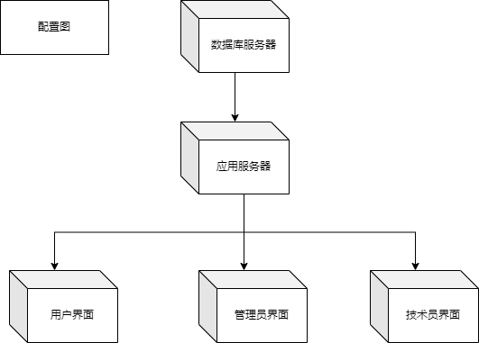
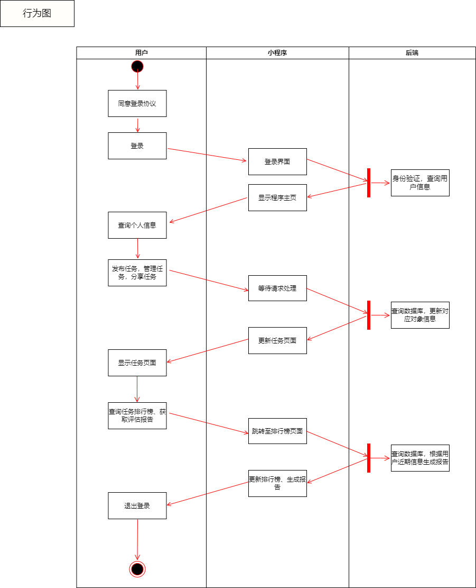

## 
需求规格说明书

### 一、分析

#### 1.1 定位与分析

随着人的素质的快速提高，人在社会上的竞争压力也逐渐增加，影响个人竞争力的不单单是天赋，更多的是努力和自律；另一方面，在快节奏的生活中，拥有一个精神寄托之处也成为新的需求。因此，我们希望设计一款轻量级、简便的小程序来帮助用户计划和管理自己的生活，用户可以在小程序上添加自己每日必做的任务，也可以记录或吐槽自己的生活。

#### 1.2 需求概述

在以最低的开发费用前提下制作一个小程序，并且能够提供完备的功能，包括：

+ 发布每日挑战

    用户可以通过这个软件发布每日挑战，内容是自己在当天需要达到的小目标。例如早起挑战，今天要在早上6点起床；早睡挑战，今天要在晚上11点睡觉；手机挑战，今天使用手机的时间要在2小时以内；单词挑战，今天要背10个单词；跑步挑战，今天要跑步1公里；等等。

+ 完成每日挑战

    对每个每日挑战，用户可以在截至时间之前进行打卡，表示该挑战已经完成。如果在截至时间之内用户没有进行打卡，则表明该挑战失败。当用户完成一个每日挑战后，就可以获取相应的挑战积分。

+ 加入每日挑战

    用户可以在软件中浏览并查询其它用户发布的每日挑战，然后可以选择是否加入该挑战。

+ 每日排行榜

    在每日排行榜中，会根据用户在今天内获取的挑战积分数量进行排名。

+ 挑战推荐

    我们的产品能够为用户推荐一些常见的挑战，例如每天运动半小时、早睡早起等。用户可以将这些挑战加入到自己的每日挑战中。

+ 日记功能

    用户除了完成各种各样的挑战之外，还能够通过日记功能来记录每一天的进步或者每一天中有意义有价值的事情。另一方面，用户能够在一段时间后通过日记来回顾自己近期的状态。

+ 打卡分享功能

    用户每天在完成自己定下的任务之后，能够进行打卡分享的功能。通过打卡分享，用户能够将自己每天完成的挑战分享给自己的好友，一方面使得产品具有更强的社交性，另一方面，用户能够通过分享也有利于产品的推广。

+ 生成近期状态评估报告

    用户在使用产品一段时间后，我们的产品能够记录用户在这段时间能挑战的完成情况以及挑战的数量来生成一份评估报告，并将其统计数据反馈给用户，用户能够将状态评估报告作为参考评估自身近期的状态，促进自我的进步发展。

#### 1.3功能总览

#### 1.4 主要的表

**用户信息表UserInfo**

| 变量名 | 类型        | 含义         | 说明                 |
| ------ | ----------- | ------------ | -------------------- |
| uid    | varchar(15) | 用户id       | 主键                 |
| uname  | varchar(15) | 用户昵称     | not null             |
| gender | bool        | 性别         | 0表示女性，1表示男性 |
| mail   | varchar(20) | 用户邮箱     |                      |
| wxid   | varchar(20) | 用户的微信号 |                      |

**任务信息表TaskInfo**

| 变量名      | 类型        | 含义         | 说明                       |
| ----------- | ----------- | ------------ | -------------------------- |
| tid         | varchar(15) | 任务编号     | 主键                       |
| tname       | varchar(15) | 任务名称     | not null                   |
| start_time  | varchar(20) | 任务发布时间 | not null                   |
| finish_time | varchar(20) | 任务完成时间 | 完成任务的最后期限         |
| finished    | bool        | 任务是否完成 | 0表示为未完成，1表示已完成 |

### 二、UML图

#### 2.1 类图

我们设计了两个类：用于存储用户信息的用户类UserInfo和用于存储任务信息的任务类TaskInfo类，在第一个类中主要存储了用户id，用户昵称，性别，用户邮箱和用户的微信号；第二个类中主要存储了任务编号，任务名称，任务发布时间，任务完成时间和任务是否已经完成。用户可以发布任务，同时用户也可以加入挑战，一个用户可以对应多个任务，一个任务也可以有多个用户参见，所以用户和任务是多对多的关系。

#### 2.2 对象图

运行过程涉及连个对象，一个是小程序一个是用户，根据设计的功能，用户主要有以下几种行为，对于每种行为，用户都需要发起请求，然后小程序经过数据处理后做出响应。

#### 2.3 组件图

 

#### 2.4配置图

在配置图中，主要有以下几个部分，分别是数据库服务器、应用服务器、用户界面、管理员界面和技术员界面。其中，数据库服务器负责将数据传递给应用服务器，应用服务器负责将数据传递给用户界面、管理员界面和技术员界面。通过各个部分的协同工作，来实现数据的传递，完成用户的请求。

 

#### 2.5 用例图

 在我们设计的每日挑战小程序中，用户能够执行的基础操作有发布每日挑战、管理每日任务，用户在执行这些操作之后，都会将对应的数据传输回系统，系统对这些数据进行维护更新以及分析；对应的扩展操作则有记录日记、打卡分享、查询评估报告。系统则能够维护每个用户的信息，同时能够针对不同的用户来推荐适合的挑战，另一方面系统还需要统计全体用户的操作情况，生成一个每日挑战的排行榜并进行发表；针对每一个不同的用户，系统能够根据用户近期的操作特征生成属于一份评估报告。

#### 2.6序列图

用户每次使用小程序时，首先需要经过登录验证的阶段，此过程需要经过后端验证成功之后前端对页面进行刷新才完成登录。登录完成之后用户才能够执行任务操作，例如管理、删除、更新每日任务，此过程同样需要将数据传送到后端来对数据库进行修改；对应查询排行榜、查询个人评估报告的操作则不需要对数据库进行修改，只需要进行查询和分析的过程，获得对应的数据之后前端再进行页面的刷新将信息反馈给用户。最后则是退出登录的过程，退出登录可以由用户主动退出也可以由计时器来实现到期自动退出。

 

#### 2.7 行为图

用户使用小程序的主要行为有登录、执行管理个人任务的基础操作、申请查询系统提供的扩展操作等。用户每次登录时，前端会显示对应的登录界面，并向后端传递登录验证，后端则更加前端传递的信息来对用户进行身份验证并查询数据库获取用户的相关信息，并将其反馈回前端，前端则将跳转至用户主页。用户每次执行管理个人任务时，前端同样需要将请求发送给后端，让后端来修改相关信息，此过程中前端将是等待状态直到后端将修改成功的信息反馈之后再刷新页面。用户每次申请查询任务排行榜时，需要后端将排行榜信息反馈给前端进行显示；用户每次查询评估报告时，前端需要维持一个等待状态，因为评估报告的生成需要一定时间，后端收到请求之后则会针对用户的信息进行分析生成一份具有针对性的报告。

 

#### 2.8 协作图

在协作图中，展示了用户、app界面、应用服务器三个部分之间的工作关系。app界面会将用户的请求反馈给应用服务器，应用服务器则会根据用户的不同请求给出对应的响应，app界面再将响应的结果返回给用户。例如，在用户登录操作中，用户先输入账号和密码，然后在app界面执行登录操作。接着，app界面就会收到用户的登录请求，并将用户的账户信息传递给应用服务器。应用服务器则会在数据库中查找对应的账户信息进行匹配，然后将匹配结果返回给app界面。app界面再根据匹配结果来执行不同指令。如果账号和密码对应，就显示登陆成功，并进行跳转。如果不对应，就返回登录失败的信息。

 

#### 2.9 状态图

在状态图中，我们给出了小程序在工作中的各种状态，以及它们之间的转换过程。根据用户在app中执行的不同操作，小程序会执行不同的指令，从而到达不同的状态，实现状态转换，完成用户的各种请求。在状态图中，主要有以下几个状态：登录状态、事务处理状态以及退出状态。在登录状态中，根据账号和密码是否匹配，跳转到不同的状态结果。如果成功登录，就会进入到事务处理状态，根据用户的不同需求，分别进入到不同的事务状态进行事务处理，然后返回响应结果。当用户输入退出请求时，程序就会进入到退出状态，将用户登出。

 

