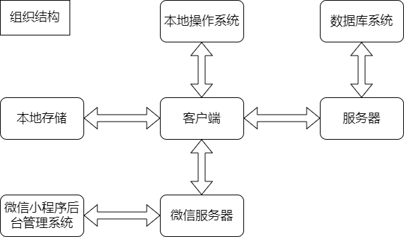
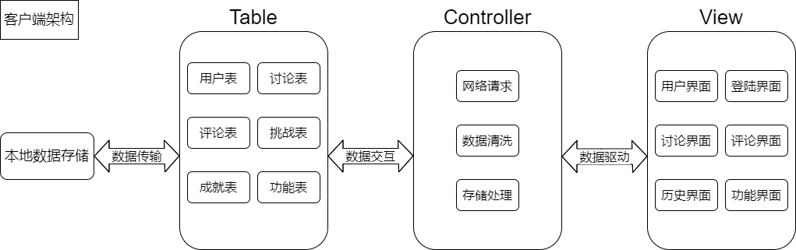
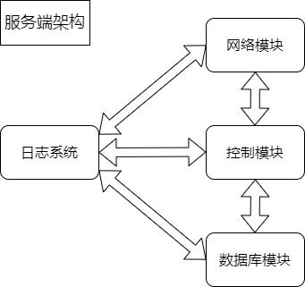
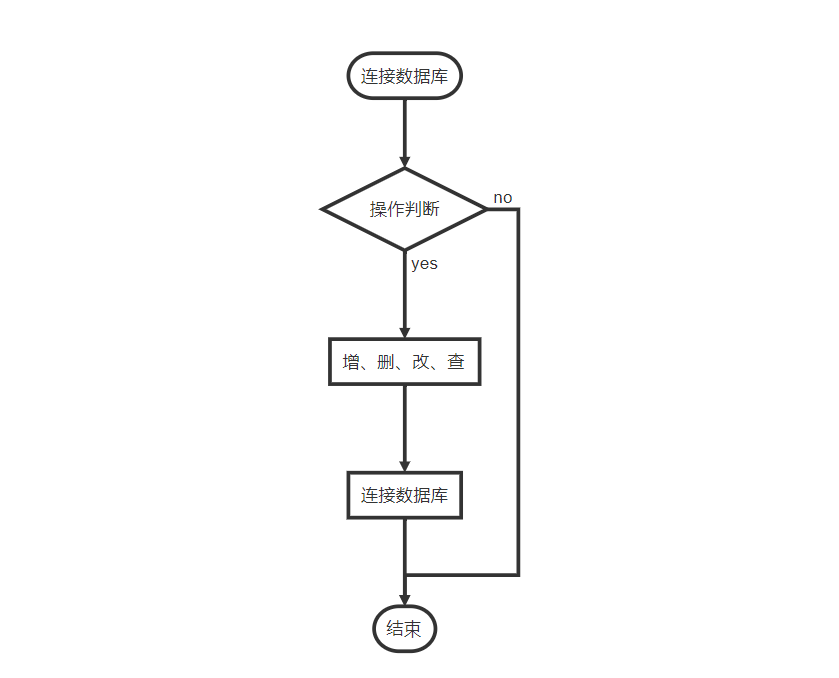
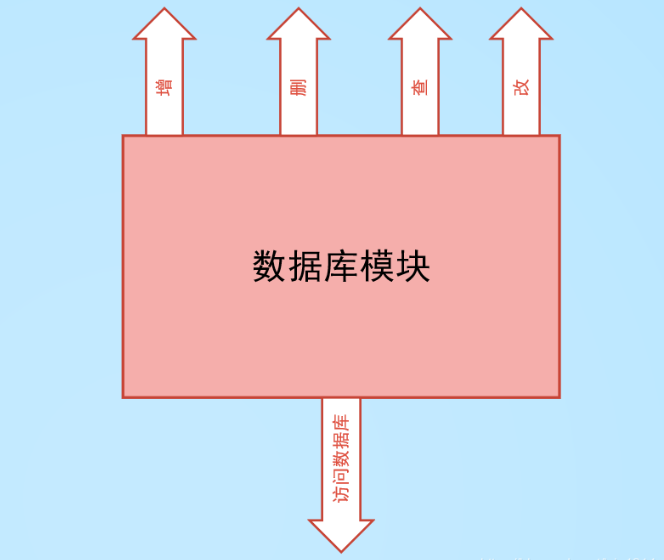

## <center>系统详细设计说明书</center>

#### 一、引言

##### 1.1 编写目的

编写 本详细设计说明书的目的主要是详细说明“每日做到”小程序的系统结构和内部设计，在概要设计说明书的基础上进一步细化系统，提供详细的程序和接口这几，为程序开发提供直接的支持。

本说明书主要面向系统分析人员，程序员和以后的系统维护人员，作为程序开发系统的根本依据和在系统维护阶段，维护人员对系统实施维护的参考资料。

##### 1.2 背景

关于小程序的基本信息主要有：

+ 项目名称：每日做到

+ 用户：微信用户

+ 运行环境：安卓、IOS

+ 开发工具：微信开发者平台

+ 开发者：每日做到小团队

​	随着人的素质的快速提高，人在社会上的竞争压力也逐渐增加，影响个人竞争力的不单单是天赋，更多的是努力和自律；另一方面，在快节奏的生活中，拥有一个精神寄托之处也成为新的需求。我们希望设计一款轻量级、简便的小程序来帮助用户计划和管理自己的生活，用户可以在小程序上添加自己每日必做的任务，也可以记录或吐槽自己的生活。

我们的小程序具有很大的现实价值：

+ 我们的小程序能够帮助用户保持一个良好的自律习惯，有助于用户提高个人素质。

+ 我们的小程序为用户提供记录生活的功能，它能够有效帮助用户管理生活，同时能够让用户释放生活压力。 

+ 我们的小程序放入每日挑战，可以激发用户的生活斗志。

+ 我们的小程序具有打卡和分享功能，能够使多个用户进行交互，具有社交性。

+ 我们的小程序可以为用户提供管理建议，有利于用户改善生活状况。

##### 1.3 定义

+ 查询：对数据库的一种操作，用于搜索数据信息。

+ 更新：对数据库的一种操作，用于更改数据库中的数据信息。

+ 前端：开发和维护与用户交互的页面

+ 后端：协调前端与数据库之间的逻辑控制程序

+ 软件结构图：用于反应软件系统的功能模块之间的关系的数据图。
+ B/S结构

​		B/S是Browser/Server的缩写，即浏览器/服务器结构，它是随着Internet技术的兴起，对C/S结构的一种变化或者改进的结构，在这种结构下，用户工作界面是通过www浏览器来实现的，极少部分事务逻辑在前端（Brower）实现，但主要事务在服务器端（Server）实现，形成所谓三层3-tier结构。这样大大简化了客户端电脑载荷，减轻了系统维护与升级的成本和工作量，降低了用户的总体成本。

##### 1.3 参考资料

【1】GB-T 8567-1988 计算机软件产品开发文件编制指南

【2】GB-T 8567-2006 计算机软件文档编制规范

【3】IEEE 1016-2009 - IEEE Standard for Information Technology--Systems Design--Software 		  Design Descriptions

#### 二、程序系统的组织结构



- 客户端：客户系统提供本地服务

- 服务端：向客户端提供资源，保存客户端数据

- 数据库系统：存储客户端资源及相关信息

- 本地操作系统：客户端提供交互界面的服务

- 本地存储：存储客户端的相关资源

- 微信服务器：提供UCM的应用生态服务

- 微信小程序后台管理系统：小程序开发者管理小程序的版本更新及用户数据分析


##### 客户端架构如下图所示：



##### Table(数据表)：

用户表：记录用户的基本信息
讨论表：记录用户发布的讨论信息
评论表：记录用户发布的的评论信息
挑战表：记录所有挑战项目的信息
成就表：记录所有成就的信息
功能表：记录小程序的功能信息

##### Controller(控制块)：

网络请求：提供连接服务
数据清洗：根据算法设计，对数据表的数据进行处理
存储处理：根据存储请求，将相关数据存储到对应数据表

##### View(视图)

用户界面：用户的基本信息界面
登陆界面：用户的登陆界面
讨论界面：用户的讨论界面
评论界面：用户的评论界面
历史界面：用户的浏览历史界面
功能界面：用户的功能界面

##### 服务端架构如下图所示：



##### 日志系统：自动记录各数据，各进程和异常信息

##### 网络模块：提供连接服务

##### 控制模块：根据服务请求，进行不同模块的控制

##### 数据库操作模块：对数据库的进行操作，包括添加、删除、修改和查询。

#### 三、网络模块

##### 3.1 程序描述

“每日做到”网络程序主要用于衔接和管理用户自己设置的“每日做到”各项，包括对用户每日任务的添加、删除、查询、更新等。

##### 3.2 功能

| 功能         | 传递内容                   | 格式/请求 |
| ------------ | -------------------------- | --------- |
| 用户身份认证 | userid，username，password | json/POST |
| 每日挑战查询 | userid，taskid             | json/POST |
| 每日挑战删除 | userid，taskid             | json/POST |
| 每日挑战更新 | userid，taskid             | json/POST |
| 每日挑战添加 | userid                     | json/POST |

##### 3.3 性能

| 运行功能     | 模块组合             | 相应时间（ms） |
| ------------ | -------------------- | -------------- |
| 用户身份认证 | 登录模块、数据库模块 | 1000           |
| 每日挑战查询 | 数据库模块、后端模块 | 200            |
| 每日挑战删除 | 所有模块             | 500            |
| 每日挑战更新 | 数据库模块、后端模块 | 500            |
| 每日挑战添加 | 数据库模块、后端模块 | 200            |

##### 3.4 输入项

| 功能         | 输入项                     |
| ------------ | -------------------------- |
| 用户身份认证 | userid，username，password |
| 每日挑战查询 | userid，taskid             |
| 每日挑战删除 | userid，taskid             |
| 每日挑战更新 | userid，taskid，data       |
| 每日挑战添加 | userid，data               |

##### 3.5 输出项目

| 功能         | 输出项                                 |
| ------------ | -------------------------------------- |
| 用户身份认证 | code、msg、identity                    |
| 每日挑战查询 | code、msg、datatype、dentity、tasklist |
| 每日挑战删除 | code、msg、datatype、dentity、tasklist |
| 每日挑战更新 | code、msg、datatype、dentity、tasklist |
| 每日挑战添加 | code、msg、datatype、dentity、tasklist |

##### 3.6 算法

API接口防止重放攻击和第三方滥用攻击算法：

| 字段名    | 类型 | 含义       | 必填 | 备注                                   |
| --------- | ---- | ---------- | ---- | -------------------------------------- |
| a         | text | 请求的字段 | true |                                        |
| b         | text | 请求字段   | true |                                        |
| appkey    | text | 客户端标识 | true | 一段客户端的唯一标识                   |
| salt      | text | 随机数     | true |                                        |
| timestamp | text | 时间戳     | true |                                        |
| sign      | text | sha256签名 | true | sha256(a+b+appKey+salt+timestamp+密钥) |

使用加密方式sha256(a+b+appKey+salt+timestamp+密钥)来保证API接口的安全性。

##### 3.7 流程逻辑

用户操作 -> 向服务器发送请求 -> 服务器验证是否合法 -> 执行相应的操作

##### 3.8 接口

本程序所隶属的上一层模块及隶属于本程序的下一模块、参数赋值和调用方式，说明与本程序具有直接关系之数据结构（数据库、数据文卷）。

##### 3.9 存储分配

| 软件   | 内存分配                    | 备注             |
| ------ | --------------------------- | ---------------- |
| 客户端 | 内存：500KB，本地存储：10MB | 微信限制         |
| 服务器 | 内存：200MB，硬盘：50G      | 根据需要进行扩容 |
| 数据库 | 内存：1G，硬盘：100G        | 根据需要进行扩容 |

##### 3.10 注释设计

1.单行注释（single-line）：//注释内容

 一次只能注释一行，一般是简单注释，用来简短描述某个变量或属性，程序块。

2.块注释（block）：/*注释内容*/

 为了进行多行简单注释，一般不使用。

3.文档注释：/**注释内容 *\*/

##### 3.11 限制条件

必须在连接互联网的情况下才能使用本模块，否则将提示网络异常信息。

##### 3.12 测试计划

需要结合其它模块才能测试，此处不做说明。

#### 四、数据库操作模块

##### 4.1 程序描述

数据库操作的封装模块

##### 4.2 功能

对数据库的增删改查进行功能封装，提供统一 的接口

##### 4.3 性能

| 功能                 | 模块组合                       | 资源占用时间(ms) |
| -------------------- | ------------------------------ | ---------------- |
| 微信登录             | 登录模块，数据库模块，网络模块 | 20               |
| 发布每日挑战         | 数据库模块，功能模块           | 20               |
| 每日打卡             | 数据库模块，功能模块           | 20               |
| 挑战推荐             | 数据库模块，功能模块           | 20               |
| 日记功能             | 数据库模块，功能模块           | 20               |
| 删除                 | 数据库模块                     | 30               |
| 生成近期状态评估报告 | 数据库模块，功能模块           | 100              |

##### 4.4 输入项

用户的请求，包括：

+ 登录小程序
+ 发布每日挑战
+ 完成每日挑战
+ 加入每日挑战
+ 写日记
+ 打卡分享
+ 生成近期状态评估报告

##### 4.5 输出项目

操作反馈

##### 4.6 算法

表查询的算法，涉及的主要有：

**条件查询**

在单个表中，对表的某个列进行查询。

例如，登录时需要查询用户的密码，从而验证密码是否正确，比如要查询用户"Jone"的密码，则对应的`sql`语句为：

~~~sql
select password
from UserInfo
where uname="Jone"
~~~

**自然连接**

在连接条件中使用等于运算符比较被连接列的列值，但他使用选择列表指出查询结果集合中所包括的列，并删除连接表中的重复列。

例如：要检索所有由名为“Jone"发起的挑战的完成时间，则对应的sql语句为：

````sql
select finish_time
from UserInfo join TaskInfo on  uid	where uname = "Jone"
````

##### 4.7 流程逻辑



##### 4.8 接口



##### 4.9 存储分配

| 模块   | 存储                          | 说明                       |
| ------ | ----------------------------- | -------------------------- |
| 数据库 | 内存：1GB          硬盘：30GB | 根据用户规模可进行定期调整 |

##### 4.10 注释设计

1.单行注释： //注释内容

用来简单描述某个变量或属性，程序块。

2.块注释： /\*  注释内容   \*/

进行多行简单注释

3.文档注释：/\*\*     注释内容   \*/

主要说明文档的时间，功能，编写人等信息

4.类注释：/\*\*    注释内容    \*\*/

类注释(Class)主要用来声明该类用来做什么，以及创建者、创建日期版本、包名等一些信息

5.方法注释：/\*\*    注释内容    \*\*/

方法注释(Methods)主要用来声明该类的作用、入参、返回值、异常等信息。

##### 4.11 限制条件

数据库存储在服务器端，所以用户需要连接网络才能访问数据库。

##### 4.12 测试计划

| 测试项目     | 输入                                                         |
| ------------ | ------------------------------------------------------------ |
| 写入数据库   | 1.每个数据表的测试数据应包括：输入完整，不完整，字段非法等情况 <br/>2.多表插入，单表插入 |
| 查询数据库   | 单表查询，多表查询                                           |
| 从数据库删除 | 无                                                           |

##### 4.13 尚未解决

+ 大数据量下的数据库的分库分表操作
+ 多用户的并发访问数据库

#### 五、功能模块

##### 5.1 程序描述

功能模块主要是对用户挑战完成情况进行功能信息的采集与标签化的模块，通过发布功能系统，采集用户对标记点的功能模块化介绍，以及标签的集成处理，得到对应的功能介绍。

##### 5.2 功能

用户在功能界面，根据界面信息的渲染，对某些标记点的功能信息进行展示。其逻辑为用户对某特定标记点发出功能列表的请求，向功能表获取对应的功能列表，然后得到对应信息更新到标记点表中。

| 功能         | 传递内容                       | 格式/请求 |
| ------------ | ------------------------------ | --------- |
| 获取功能列表 | userid，locationid，datatype   | json/POST |
| 发布功能     | userid，locationid，functionid | json/POST |

##### 5.3 性能

| 运行功能     | 模块组合                                   | 相应时间（ms） |
| ------------ | ------------------------------------------ | -------------- |
| 发布功能     | 根据对应的数据项多少，其性能可能略有些区别 | 200            |
| 获取功能列表 | 数据库的表项查询精度较高，查询速度响应较快 | 20             |

##### 5.4 输入项

| 功能         | 输入项                         |
| ------------ | ------------------------------ |
| 获取功能列表 | userid，locationid，datatype   |
| 发布功能     | userid，locationid，functionid |

##### 5.5 输出项目

| 功能         | 输出项               |
| ------------ | -------------------- |
| 获取功能列表 | code, msg, data      |
| 发布功能     | code, msg, data, uid |

##### 5.6 算法

维护标记点列表，进行数据的收集和分析。

##### 5.7 流程逻辑

用户 -> 发布功能请求 -> 功能模块 -> 界面渲染

发布功能模块 -> 写入标记点表 -> 标记点 -> 返回标记点表状态信息 

发布功能模块 -> 写入功能表数据 -> 功能表 -> 返回功能表状态信息 

##### 5.8 接口

需要访问数据库接口和添加、获取功能的接口

##### 5.9 存储分配

| 软件   | 内存分配                    | 备注             |
| ------ | --------------------------- | ---------------- |
| 客户端 | 内存：500KB，本地存储：10MB | 微信限制         |
| 数据库 | 内存：1G，硬盘：100G        | 根据需要进行扩容 |

##### 5.10 注释设计

1.单行注释（single-line）：//注释内容

 一次只能注释一行，一般是简单注释，用来简短描述某个变量或属性，程序块。

2.块注释（block）：/*注释内容*/

 为了进行多行简单注释，一般不使用。

3.文档注释：/**注释内容 *\*/

##### 5.11 限制条件

 无

##### 5.12 测试计划

结合网络模块、数据库模块进行测试
