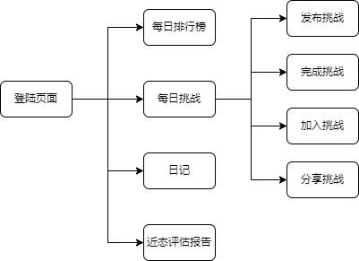
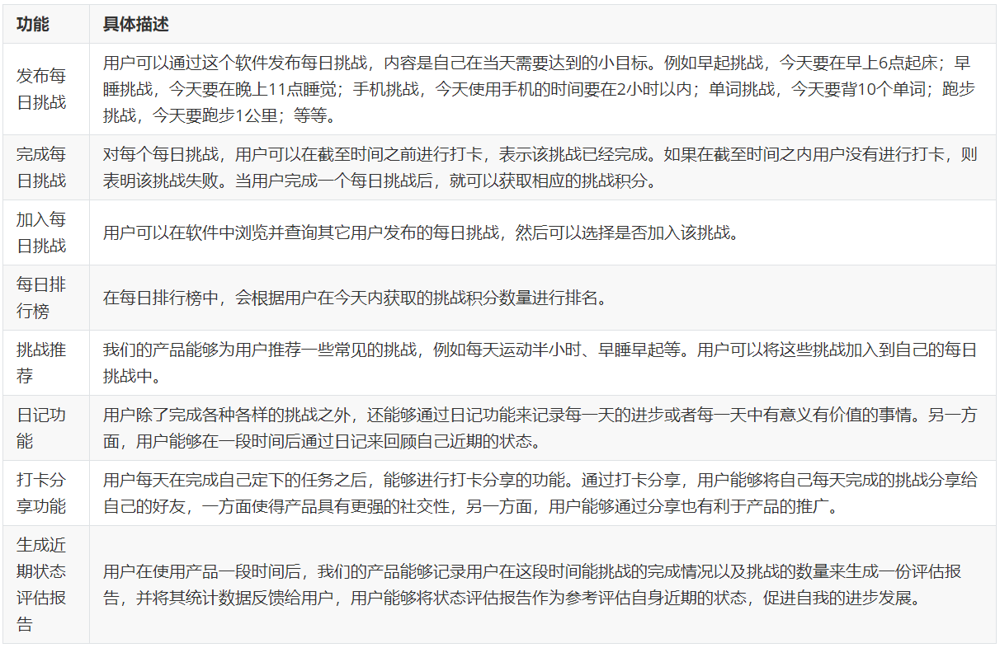
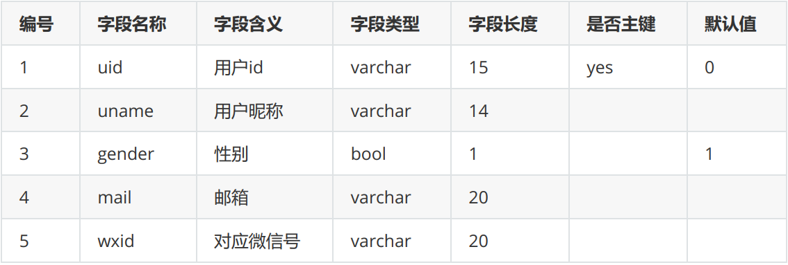
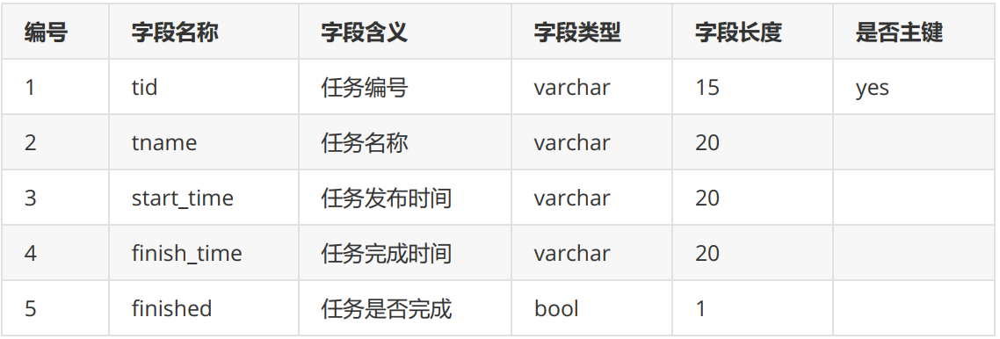
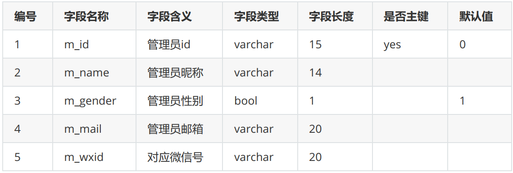
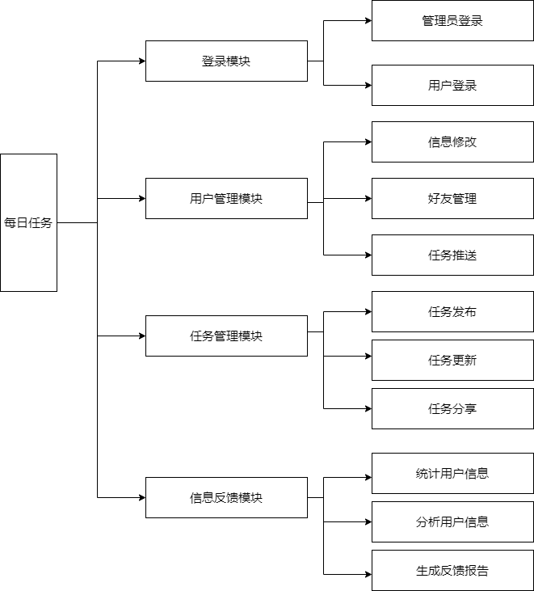

## 
软件需求规格说明书

### 一、引言

#### 1.1 定位与目标

随着人的素质的快速提高，人在社会上的竞争压力也逐渐增加，影响个人竞争力的不单单是天赋，更多的是努力和自律；另一方面，在快节奏的生活中，拥有一个精神寄托之处也成为新的需求。因此，我们希望设计一款轻量级、简便的小程序来帮助用户计划和管理自己的生活，用户可以在小程序上添加自己每日必做的任务，也可以记录或吐槽自己的生活。

#### 1.2 对象

对于软件需求规格说明书，我们的预期阅读对象由以下几个部分组成： 

项目开发组成员
项目测试组成员
其他需要了解项目的相关人员

#### 1.3 软件需求分析理论

软件需求分析是研究用户需求得到的东西，完全理解用户对软件需求的完整功能，确认用户软件功能需求，建立可确认的、可验证的一个基本依据。软件需求分析是一个项目的开端，也是项目实施最重要的关键点。据有关机构的分析表明，在我们设计的软件产品种存在的不完整性、不正确性等问题80％以上是需求分析错误所导致的，而且由于需求分析错误造成根本性的功能问题尤为突出。因此，一个项目的成功软件需求分析是关键的一步。

#### 1.4 软件需求分析目标

软件需求分析的主要实现目标：

1）对实现软件的功能做全面的描述，帮助用户判断实现功能的正确性、一致性和完整性，促使用户在软件设计启动之前周密全面地思考软件需求；

2）了解和描述软件实现所需的全部信息，为软件设计、确认和验证提供一个基准；

3）为软件管理人员进行软件成本计价和编制软件开发计划书提供依据；

需求分析的具体内容可以归纳为六个方面：软件的功能需求，软件与硬件或其他外部系统接口，软件的非功能性需求，软件的反向需求，软件设计和实现上的限制，阅读支持信息。

软件需求分析应尽量提供软件实现功能需求的全部信息，使得软件设计人员和软件测试人员不再需要需求方的接触。这就要求软件需求分析内容应正确、完整、一致和可验证。此外，为保证软件设计质量，便于软件功能的休整和验证，软件需求表达无岔意性，具有可追踪性和可修改性。

### 二、 需求概述

#### 2.1 项目背景

##### 2.1.1 技术背景

小程序相比APP，有着巨大的优势：

**易获取**

小程序具备各大API数据数据接口，可帮助非个人小程序平台的商户获取相应的会员营销建设性信息。如：微信头像、昵称、性别、城市、手机号码、地理位置等。

**易使用**

小程序是一种不需要下载安装即可使用的应用，它实现了应用“触手可及”的梦想，用户扫一扫或者搜一下即可打开应用。也体现了“用完即走”的理念，用户不用关心是否安装太多应用的问题。应用将无处不在，随时可用，但又无需安装卸载。小程序除了有以上易使用的特点外，还可一键添加到桌面。

**易传播**

微信小程序在微信用户10亿+的基础，现日活跃用户达到两个亿+。小程序应用数量超过了一百万，覆盖200多个细分的行业。它是订阅号、服务号、企业微信的并行体系。是腾讯.微信的一个重要组成部分。微信小程序依靠着微信自身的资源与功能优势，给商家提供了一个传播量充足的平台。

应用：小程序上线后，可通过转发朋友和微信群、关联公众号、在图文内容插入当小程序、

附近小程序、微信搜索。更好地传播自己的小程序。也可在线下进行传播推广，比如海报、DM单、广告牌、车身广告等加上小程序码，通过微信扫一扫后也能触达小程序。

同时，小程序具有开发周期短，入门门槛低的特点，对于开发者而言，小程序开发门槛相对较低，难度不及APP，能够满足简单的基础应用，适合生活服务类线下商铺以及非刚需低频应用的转换。目前小程序的开发流程已经十分完备和成熟。

##### 2.1.2 社会背景

现代社会是一个快节奏的社会，每个人每天都有很多事情要做，如果我们没有一个良好的习惯，就很容易陷入迷茫，整天忙碌，却又无所事事。

习惯是人生成败的关键，好习惯实际上是好多思维方式与好的行为方式，一个好的习惯，可以是每天看书，也可以是每天运动，甚至是早睡，这些行为看似细小，却能给我们带来很大帮助。首先我们养成了习惯，然后随后习惯养成了我们，我们之所以会形成今天的自己，乃是习惯造成的，如果我们想要跟以前有截然不同的人生，就要有巨大的改变，就本质而言，我们的行为并非一成不变，而是受身心发展和客观环境的影响，随时在变化。

所以说，为了养成一个好习惯，我们就要打破过去的行为方式，这不仅需要决心，也需要外界的帮助和监督。

手机已经成为当今社会的必需品，所以通过手机来监督我们无疑是一条好的途径，我们的小程序正是为此而生，通过给自己制定目标，并以每日打卡的方式监督自己的执行情况，从而达到培养习惯的目的。为了使我们的软件更加便携轻量，我们选择小程序的开发方式。

##### 2.1.3 经济背景

移动互联时代下的流量获取及变现的成本居高不下，APP作为一个闭环生态，无论是获客还是保持客户的粘性都进入瓶颈，传统的电商及相关的线上业务开展已无法满足很多商户及用户的需求。尤其是B端商户，运营成本越来越高，转化却日益低迷。他们需要一个新的获客及转化通道。而天生自带流量的小程序，无需下载安装，用户可直达商户，则极大的解决了当前B端商户的困境，同时也为用户在一个APP生态内提供各种各样的生活服务。小程序相较于APP的进入门槛更低，开发周期更短，费用更低。

目前市场上很少APP以帮助用户培养习惯为目的，所以我们的软件有着良好的市场。

#### 2.2 需求概述

在以最低的开发费用前提下制作一个小程序，并且能够提供完备的功能，包括：

1、发布每日挑战

用户可以通过这个软件发布每日挑战，内容是自己在当天需要达到的小目标。例如早起挑战，今天要在早上6点起床；早睡挑战，今天要在晚上11点睡觉；手机挑战，今天使用手机的时间要在2小时以内；单词挑战，今天要背10个单词；跑步挑战，今天要跑步1公里；等等。

2、完成每日挑战

对每个每日挑战，用户可以在截至时间之前进行打卡，表示该挑战已经完成。如果在截至时间之内用户没有进行打卡，则表明该挑战失败。当用户完成一个每日挑战后，就可以获取相应的挑战积分。

3、加入每日挑战

用户可以在软件中浏览并查询其它用户发布的每日挑战，然后可以选择是否加入该挑战。

4、每日排行榜

在每日排行榜中，会根据用户在今天内获取的挑战积分数量进行排名。

5、挑战推荐

我们的产品能够为用户推荐一些常见的挑战，例如每天运动半小时、早睡早起等。用户可以将这些挑战加入到自己的每日挑战中。

6、日记功能

用户除了完成各种各样的挑战之外，还能够通过日记功能来记录每一天的进步或者每一天中有意义有价值的事情。另一方面，用户能够在一段时间后通过日记来回顾自己近期的状态。

7、打卡分享功能

用户每天在完成自己定下的任务之后，能够进行打卡分享的功能。通过打卡分享，用户能够将自己每天完成的挑战分享给自己的好友，一方面使得产品具有更强的社交性，另一方面，用户能够通过分享也有利于产品的推广。

8、生成近期状态评估报告

用户在使用产品一段时间后，我们的产品能够记录用户在这段时间能挑战的完成情况以及挑战的数量来生成一份评估报告，并将其统计数据反馈给用户，用户能够将状态评估报告作为参考评估自身近期的状态，促进自我的进步发展。

#### 2.3 系统结构

### 三、系统功能需求

#### 3.1 功能总览

 

#### 3.2 数据字典

##### 3.2.1 用户信息表

 

##### 3.2.2 任务信息表

 

##### 3.2.3 管理员信息表

 

#### 3.3 业务流程图

### 四、软硬件及外部系统接口需求

#### 4.1 用户界面

本设计将通过小程序实现，为用户提供一个美观，大方，操作简单的用户界面。设计小程序界面的时候，我们将从以下三个方面进行考虑：

**功能化**：

小程序由于没有APP的体量，因此在设计时首要突出主要功能，但单一的功能会失去很多趣味性，因此在设计时还需要围绕功能添加额外充满吸引力的功能或活动。比如将软件的几个功能在主界面清晰地呈现给用户。

**简单化**：

微信官方要求小程序代码内容不能超过2M，所以运营者在界面设计的过程中需要保证简单化，具体表现为功能简约、操作简单、界面简洁。在业务逻辑上尽量保证小程序的业务逻辑精简到4个页面以内。在我们的设计中，我们将尽量保证将小程序的业务逻辑控制在三个页面，即主界面，功能界面，效果界面。

**商业化**：

我们的设计将会围绕用户进行，从用户出发，保证用户具有最佳的体验。

#### 4.2 硬件需求

选择硬件时我们主要从**可靠性，可用性，安全性**出发，由于我们使用的是小程序实现，不需要额外的硬件，所以这部分先不做考虑

#### 4.3运行环境

+ 微信：小程序需要依托微信运行，所以要求用户的手机下载微信
+ 分辨率：由于小程序会自动适配用户手机的分辨率，所以我们的产品可以在任何智能手机上运行。

### 五、可靠性与可用性需求

#### 5.1性能需求

**处理能力**：

由于是功能性小程序，我们主要考虑系统能承载的最大并发用户数，通过查阅资料，基本的小程序很少出现崩溃的情况，所以我们基本可以保证我们的小程序能同时满足足够多的用户的需求，

**响应时间**：

用户最终得到结果的响应时间除了与系统响应速度有关外，还与网络状态有关，我们在设计过程中会尽量减少视频，动图的使用，以加快用户获取结果的速度。

#### 5.2 安全性需求

传输数据是依托微信进行， 微信的数据传输都是进过层层加密的，所以可以保证数据传输过程中的安全性。同时，登陆时会要求用户进行登陆认证，而且尽可能将用户数据保存在用户手机而不上传，避免用户数据泄露。