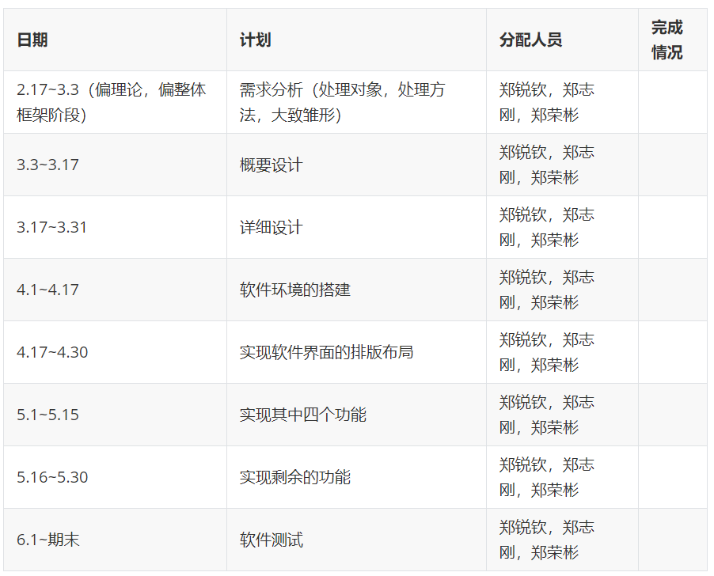

## 
项目可行性报告

### 一、项目题目

“每日做到”小程序开发

### 二、项目背景

#### 2.1技术背景

小程序相比APP，有着巨大的优势：

**易获取**

小程序具备各大API数据数据接口，可帮助非个人小程序平台的商户获取相应的会员营销建设性信息。如：微信头像、昵称、性别、城市、手机号码、地理位置等。

**易使用**

小程序是一种不需要下载安装即可使用的应用，它实现了应用“触手可及”的梦想，用户扫一扫或者搜一下即可打开应用。也体现了“用完即走”的理念，用户不用关心是否安装太多应用的问题。应用将无处不在，随时可用，但又无需安装卸载。小程序除了有以上易使用的特点外，还可一键添加到桌面。

**易传播**

微信小程序在微信用户10亿+的基础，现日活跃用户达到两个亿+。小程序应用数量超过了一百万，覆盖200多个细分的行业。它是订阅号、服务号、企业微信的并行体系。是腾讯.微信的一个重要组成部分。微信小程序依靠着微信自身的资源与功能优势，给商家提供了一个传播量充足的平台。

应用：小程序上线后，可通过转发朋友和微信群、关联公众号、在图文内容插入当小程序、

附近小程序、微信搜索。更好地传播自己的小程序。也可在线下进行传播推广，比如海报、DM单、广告牌、车身广告等加上小程序码，通过微信扫一扫后也能触达小程序。

同时，小程序具有开发周期短，入门门槛低的特点，对于开发者而言，小程序开发门槛相对较低，难度不及APP，能够满足简单的基础应用，适合生活服务类线下商铺以及非刚需低频应用的转换。目前小程序的开发流程已经十分完备和成熟。

#### 2.2 社会背景

现代社会是一个快节奏的社会，每个人每天都有很多事情要做，如果我们没有一个良好的习惯，就很容易陷入迷茫，整天忙碌，却又无所事事。

习惯是人生成败的关键，好习惯实际上是好多思维方式与好的行为方式，一个好的习惯，可以是每天看书，也可以是每天运动，甚至是早睡，这些行为看似细小，却能给我们带来很大帮助。首先我们养成了习惯，然后随后习惯养成了我们，我们之所以会形成今天的自己，乃是习惯造成的，如果我们想要跟以前有截然不同的人生，就要有巨大的改变，就本质而言，我们的行为并非一成不变，而是受身心发展和客观环境的影响，随时在变化。

所以说，为了养成一个好习惯，我们就要打破过去的行为方式，这不仅需要决心，也需要外界的帮助和监督。

手机已经成为当今社会的必需品，所以通过手机来监督我们无疑是一条好的途径，我们的小程序正是为此而生，通过给自己制定目标，并以每日打卡的方式监督自己的执行情况，从而达到培养习惯的目的。为了使我们的软件更加便携轻量，我们选择小程序的开发方式。

#### 2.3经济背景

移动互联时代下的流量获取及变现的成本居高不下，APP作为一个闭环生态，无论是获客还是保持客户的粘性都进入瓶颈，传统的电商及相关的线上业务开展已无法满足很多商户及用户的需求。尤其是B端商户，运营成本越来越高，转化却日益低迷。他们需要一个新的获客及转化通道。而天生自带流量的小程序，无需下载安装，用户可直达商户，则极大的解决了当前B端商户的困境，同时也为用户在一个APP生态内提供各种各样的生活服务。小程序相较于APP的进入门槛更低，开发周期更短，费用更低。

目前市场上很少APP以帮助用户培养习惯为目的，所以我们的软件有着良好的市场。

#### 2.4 目标概述

在以最低的开发费用前提下制作一个小程序，并且能够提供完备的功能，包括：

+ 发布每日挑战
+ 完成每日挑战
+ 加入每日挑战
+ 每日排行榜
+ 日记功能
+ 打卡分享功能
+ 生成近期状态评估报告

### 三、产品项目的表现形态、主要功能和性能

#### 3.1 产品的表现形态

微信小程序

在当前的社会中，微信作为被广泛使用的社交软件，以微信小程序为产品形态能够非常有效地将产品推向广大用户。另一方面，我们的软件旨在服务于日常生活，因此轻量级、用户易上手也是产品所需要具备的特征，而微信小程序在这两个方面都有优秀的体现。

#### 3.2 主要功能

+ 发布每日挑战。

    用户可以通过这个软件发布每日挑战，内容是自己在当天需要达到的小目标。例如早起挑战，今天要在早上6点起床；早睡挑战，今天要在晚上11点睡觉；手机挑战，今天使用手机的时间要在2小时以内；单词挑战，今天要背10个单词；跑步挑战，今天要跑步1公里；等等。

+ 完成每日挑战

    对每个每日挑战，用户可以在截至时间之前进行打卡，表示该挑战已经完成。如果在截至时间之内用户没有进行打卡，则表明该挑战失败。当用户完成一个每日挑战后，就可以获取相应的挑战积分。

+ 加入每日挑战

    用户可以在软件中浏览并查询其它用户发布的每日挑战，然后可以选择是否加入该挑战。

+ 每日排行榜

    在每日排行榜中，会根据用户在今天内获取的挑战积分数量进行排名。

+ 挑战推荐

    我们的产品能够为用户推荐一些常见的挑战，例如每天运动半小时、早睡早起等。用户可以将这些挑战加入到自己的每日挑战中。

+ 日记功能

    用户除了完成各种各样的挑战之外，还能够通过日记功能来记录每一天的进步或者每一天中有意义有价值的事情。另一方面，用户能够在一段时间后通过日记来回顾自己近期的状态。

+ 打卡分享功能

    用户每天在完成自己定下的任务之后，能够进行打卡分享的功能。通过打卡分享，用户能够将自己每天完成的挑战分享给自己的好友，一方面使得产品具有更强的社交性，另一方面，用户能够通过分享也有利于产品的推广。

+ 生成近期状态评估报告

    用户在使用产品一段时间后，我们的产品能够记录用户在这段时间能挑战的完成情况以及挑战的数量来生成一份评估报告，并将其统计数据反馈给用户，用户能够将状态评估报告作为参考评估自身近期的状态，促进自我的进步发展。

#### 3.3性能

+ 快速响应

    在该软件中，响应速度是其中一个性能指标。我们希望做到用户和软件在进行交互的过程中能够尽快得到响应，提高用户的使用体验。

+ 使用方便

    软件的使用是否足够方便也是一个重要的性能指标。为了可以让软件的使用尽可能方便，我们选择微信小程序作为平台进行开发。用户只需要进入小程序界面，就可以进行交互，而不需要下载额外的插件。

+ 操作简单

    在该软件中，我们希望让用户的交互操作尽可能的简单，只需要进行少量的点击操作就可以实现界面的跳转以及功能的实现。

+ 功耗小

    不需要占用大量计算资源，有利于用户的流畅性体验。

### 四、 项目技术路线和技术成熟度分析

#### 4.1 技术路线

我们计划使用小程序来实现我们的创意，所以下面主要介绍小程序需要的技术原理，一般情况下，开发一个小程序会涉及到**四个部分**：前端小程序，后台管理系统，API接口，数据库。

+ 前端小程序

    前端小程序主要有原生开发，第三方框架，H5网页封装三种，从性能及体验上来看，原生开发>第三方框架>H5网页封装，通过对比三种不同的开发方式，我们最终决定选用原生开发的方式，即按照小程序官方文档中的描述来开发小程序，这种方式的体验和性能是最好的。

+ 后台管理系统

    后台管理系统就是用于对小程序中会用到的以及产生的数据进行管理，分析。对比几种常用的后天开发语言，我们决定采用`java`语言作为后台开发语言。

+ API接口

    为了效率，在开发小程序过程中是前后端分离的，这就要求后端要有完善的API接口，前段通过调用后端开发的API进行数据的调用。

+ 数据库

    小程序运行过程中会产生大量的数据，为了方便管理这些数据以及保护数据，必须使用数据库来管理这些数据，我们选择`MySql`数据库作为我们的数据库，主要因为它性能好，体积小安装方便，易于维护。

基于上面四个主要的开发部分，我们可以采用前后端分离的办法，通过前后端同时并行开发来加快产品研发速度。其中最为重要的应该是后台管理系统，也就是逻辑层的搭建，我们首先需要根据我们设计的产品功能，为不同功能创建不同的对象，然后根据具体的功能来设计不同的函数，并将这些函数进行发布作为前端连接的API接口，后台管理系统还需要充当一个中介的作用，根据用户的不同请求来提取数据库中不同的信息进行反馈。至于前端开发，主要设计简洁、美观的页面，然后利用后端提供的接口来进行数据的传输。

#### 4.2 技术成熟度分析

**前端开发：**微信小程序使用WXML、WXSS、JS这个主要技术来进行前端开发，其中WXML和WXSS和HTML和CSS是类似的，Web三件套是经过多年的开发和完善，被广大开发者使用，这些技术都是成熟高效的，因此WXML、WXSS、JS同样能够设计出各式各样的前端页面和交互接口。单从前端开发角度看，微信小程序开发和React，Vue差不多，都很容易上手，敏捷开发，但是，从更系统的角度看，小程序具有更系统、更原生、更安全的特性。因为微信小程序有自己独立并保持快速迭代的开发工具，同时能提供诸多原生API，通过微信客户端的渲染，小程序的交互实现更接近app原生。

**后端开发：**小程序的主要开发语言是 JavaScript ，小程序的开发同普通的网页开发相比有很大的相似性。网页开发者可以使用到各种浏览器暴露出来的 DOM API，进行 DOM 选中和操作。而小程序的逻辑层和渲染层是分开的，逻辑层运行在 JSCore 中，并没有一个完整浏览器对象，因而缺少相关的DOM API和BOM API。这一区别导致了前端开发非常熟悉的一些库，例如 jQuery、 Zepto 等，在小程序中是无法运行的。同时 JSCore 的环境同 NodeJS 环境也是不尽相同，所以一些 NPM 的包在小程序中也是无法运行的。这是微信小程序后端开发的一个缺点。另一方面，微信小程序开发官方提供了许多的API接口和组件，通过这些现成的技术，能够简化开发的过程同时使产品具有更强的技术性。

### 六、项目风险分析

​		软件开发项目的风险是指在软件生命周期中所遇到的所有的预算、进度、控制等各方面的问题，以及由这些问题产生的对软件项目的影响。由于软件开发项目具有连续性、复杂性等特点，其风险程度较高。通过风险分析，我们可以在很大程度上提高项目的成功性，减少开发过程中的损失。因此，对项目进行风险分析是十分必要的。

​		软件项目风险通常包括以下五个方面：规模风险、需求风险、相关性风险，技术风险、管理风险。下面就这六个方面分别对本项目进行风险分析。

#### 6.1 规模风险

​		项目的风险是与产品的规模成正比的。一般情况下，产品规模越大，项目的风险越高。作为一个小团队的微信小程序开发项目，我们预计代码量不会太大，产品的用户数不会过多，复用的软件数目很少。因此，我们的软件开发项目的规模较小，规模风险较低。

#### 6.2 需求风险

​		项目的需求风险与项目的需求分析有关。如果在项目的开发过程中，项目需求存在很大的不确定性，即需求不明确或者需求频繁变更，那么该项目的需求风险往往较大。因此，对产品有清晰的认知、对产品需求有充分的认同、对产品需求的变化有详细的分析是十分重要的。对于我们的项目而言，我们进行了充分的用户调查，在此基础上进行具体的产品的需求分析，得到了贴合实际的产品需求。在后续的开发过程中，我们预计产品的需求不会有太多的变化。因此，我们的项目具有较低的需求风险。

#### 6.3 相关性风险

​		项目的风险有一部分是因为项目的外部环境而产生的。当项目从外部环境获取资源时，往往会带来潜在的相关性风险。我们的项目是在微信小程序平台上进行开发的，开发平台相对比较成熟，可靠性较强。同时，项目与外部的交互较少，大部分意见交流与信息传递都在开发小组内部进行。因此项目的相关性风险较低。

#### 6.4 技术风险

​		在软件开发过程中，技术风险往往是必不可少的，对项目的成功也有很大的影响。作为一个第一次进行软件开发项目的小组，我们的开发经验往往不足，对于开发技术与方法应用的掌握也有所欠缺。在开发的过程中，难免会遇到各种各样的技术问题。因此该项目的技术风险较大。但是，在项目开发的过程中，我们的技术力往往也会得到提升，技术风险可能会在一定程度上有所降低。为了更好地降低技术风险，我们需要进行风险控制，主动采取措施降低风险，或者进行风险转移。

#### 6.5 管理风险

​		管理问题是制约项目发展的一个重要问题。管理风险往往出现在计划和任务定义不够充分、实际项目状态与预期不符、项目所有者和决策者区分不清、项目成员沟通出现分歧等方面。作为一个团队项目，管理风险是必然会出现的，很有可能在项目进行的某个阶段影响项目本身。因此进行分析控制是十分必要的。对本项目而言，虽然我们是一个新的开发小组，但是我们的项目计划制定得比较完善，成员之间的沟通也比较充分。因此，我们可以在很大程度上降低管理风险。

### 七、时间进度分析

根据微信官方文档的建议和我们的实际情况，我们对我们的开发过程做出了如下规划：

 

该进度表主要以两周作为一个阶段，由于我们的实验课时一周一节课，所以两周有两节实验课，在上半学期，两节实验课基本能完成我们的预期进度，到了下半学期，可能实现过程比较繁琐，就需要更多的时间，到时我们将利用更多的课外时间来完成进度。

为了监督我们的完成情况，在完成每项进度的过程中我们都会轮流担任监督人的角色，督促组员尽快完成任务。