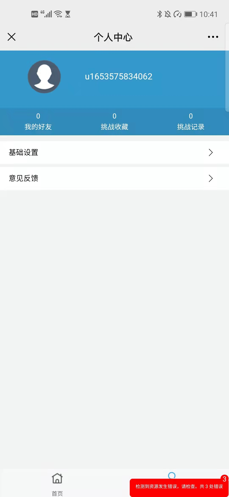
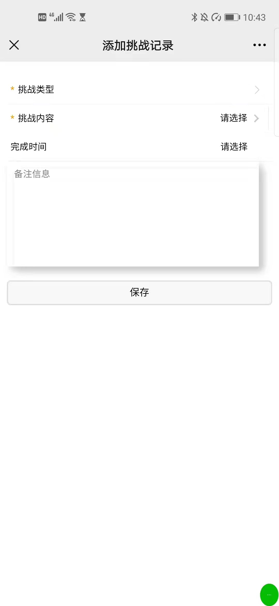
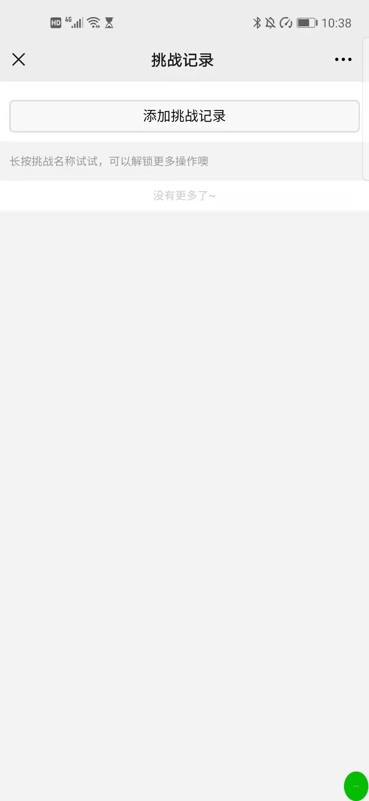
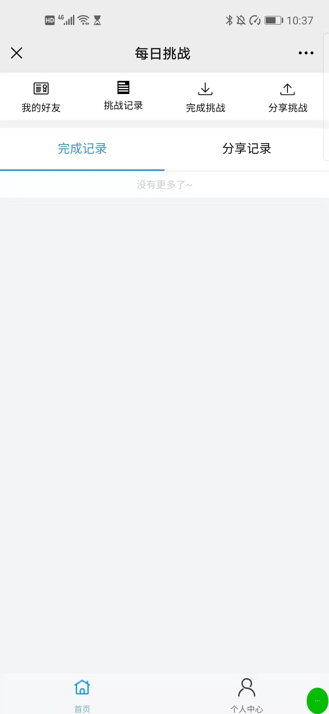
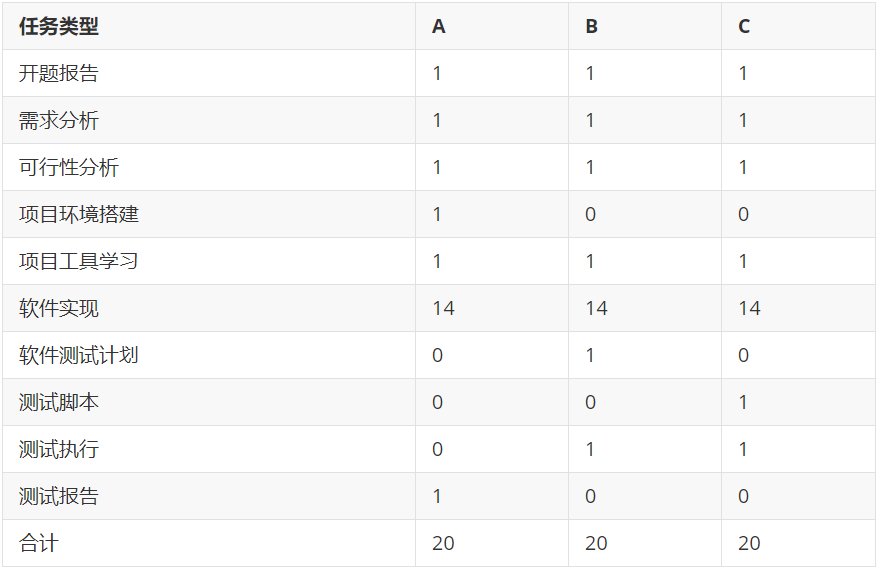

## <center>项目开发总结报告</center>

### 一、引言

#### 1.1 编写目的

##### 编写目的：

经过几个月的团队项目开发，项目的的开发工作基本完成。现以此项目开发总结报告，总结开发过程中的经验与教训，为以后的开发工作积累经验，再创辉煌。

##### 预期读者范围：

参与项目开发的所有成员。

#### 1.2 背景

##### 背景说明：

现代社会是一个快节奏的社会，每个人每天都有很多事情要做，如果我们没有一个良好的习惯，就很容易陷入迷茫，整天忙碌，却又无所事事。

习惯是人生成败的关键，好习惯实际上是好多思维方式与好的行为方式，一个好的习惯，可以是每天看书，也可以是每天运动，甚至是早睡，这些行为看似细小，却能给我们带来很大帮助。首先我们养成了习惯，然后随后习惯养成了我们，我们之所以会形成今天的自己，乃是习惯造成的，如果我们想要跟以前有截然不同的人生，就要有巨大的改变，就本质而言，我们的行为并非一成不变，而是受身心发展和客观环境的影响，随时在变化。

所以说，为了养成一个好习惯，我们就要打破过去的行为方式，这不仅需要决心，也需要外界的帮助和监督。

手机已经成为当今社会的必需品，所以通过手机来监督我们无疑是一条好的途径，我们的小程序正是为此而生，通过给自己制定目标，并以每日打卡的方式监督自己的执行情况，从而达到培养习惯的目的。为了使我们的软件更加便携轻量，我们选择小程序的开发方式。

##### a.项目名称：

每日做到

##### b.任务提出者: 

郑锐钦

##### c.开发者: 

郑锐钦、郑荣彬、郑志刚

##### d.用户: 

适用于所有年龄段

##### e.安装此软件的计算中心: 

微信小程序平台

##### f.项目类型：

微信小程序

##### g.开发平台：

微信小程序开发平台

##### h.测试平台：

微信小程序测试平台

##### i.使用平台：

微信小程序使用平台

#### 1.3 定义

本项目中使用到的术语定义如下：

##### 数据库(Database)：

按照数据结构来组织、存储和管理数据的仓库。

##### 数据用户：

数据的拥有者和使用者

#### 1.4 参考资料

##### a. 本项目已核准的计划任务书或合同、上级机关的批文：

暂无

##### b. 属于本项目的其它已发表文件：

1、项目可行性研究报告；

2、项目开发计划书；

3、软件需求说明文档；

4、概要设计说明文档；

5、详细设计说明文档；

6、测试计划，测试分析报告；

7、用户手册；

8、团队分工及任务管理；

##### c. 本文件中各处所引用的文件、资料，包括所要用到的软件开发标准：

1、GB/T 8567-2006 计算机软件文档编制规范

2、GB/T 8567-1988 计算机软件产品开发文件编制指南

3、IEEE 1016-2009 - IEEE Standard for Information Technology--Systems Design--Software Design Descriptions

4、微信小程序开发指导手册

### 二、实际开发结果

#### 2.1 产品

每日做到小程序。

主要页面如下：

|                                                      |                                                      |
| ---------------------------------------------------- | ---------------------------------------------------- |
|  |  |
|  |  |


#### 2.2 主要功能和性能

**主要功能：**

1、发布每日挑战

用户可以通过这个软件发布每日挑战，内容是自己在当天需要达到的小目标。例如早起挑战，今天要在早上6点起床；早睡挑战，今天要在晚上11点睡觉；手机挑战，今天使用手机的时间要在2小时以内；单词挑战，今天要背10个单词；跑步挑战，今天要跑步1公里；等等。

2、完成每日挑战

对每个每日挑战，用户可以在截至时间之前进行打卡，表示该挑战已经完成。如果在截至时间之内用户没有进行打卡，则表明该挑战失败。当用户完成一个每日挑战后，就可以获取相应的挑战积分。

3、加入每日挑战

用户可以在软件中浏览并查询其它用户发布的每日挑战，然后可以选择是否加入该挑战。

4、每日排行榜

在每日排行榜中，会根据用户在今天内获取的挑战积分数量进行排名。

5、挑战推荐

我们的产品能够为用户推荐一些常见的挑战，例如每天运动半小时、早睡早起等。用户可以将这些挑战加入到自己的每日挑战中。

6、日记功能

用户除了完成各种各样的挑战之外，还能够通过日记功能来记录每一天的进步或者每一天中有意义有价值的事情。另一方面，用户能够在一段时间后通过日记来回顾自己近期的状态。

7、打卡分享功能

用户每天在完成自己定下的任务之后，能够进行打卡分享的功能。通过打卡分享，用户能够将自己每天完成的挑战分享给自己的好友，一方面使得产品具有更强的社交性，另一方面，用户能够通过分享也有利于产品的推广。

8、生成近期状态评估报告

用户在使用产品一段时间后，我们的产品能够记录用户在这段时间能挑战的完成情况以及挑战的数量来生成一份评估报告，并将其统计数据反馈给用户，用户能够将状态评估报告作为参考评估自身近期的状态，促进自我的进步发展。

**性能：**

+ 快速响应

  在该软件中，响应速度是其中一个性能指标。我们希望做到用户和软件在进行交互的过程中能够尽快得到响应，提高用户的使用体验。

+ 使用方便

  软件的使用是否足够方便也是一个重要的性能指标。为了可以让软件的使用尽可能方便，我们选择微信小程序作为平台进行开发。用户只需要进入小程序界面，就可以进行交互，而不需要下载额外的插件。

+ 操作简单

  在该软件中，我们希望让用户的交互操作尽可能的简单，只需要进行少量的点击操作就可以实现界面的跳转以及功能的实现。

#### 2.3 基本流程

1、需求分析

​	需求服务的主体是用户，所以构建用户画像是需求分析的第一步。通过构建用户画像，我们可以定位用户的使用目标，以用户所处的阶段来看待产品，更有利于形成对用户的同理心，让需求分析更加符合实际。构建用户画像时先要构建一个初步形象，即用户的主要属性，用来区分不同的用户群体。然后需要了解用户的使用动机，以及用户在使用产品时可能会收到的各种影响。
​	
​	第二步是梳理使用场景，这需要我们构建一个具体的使用场景，并进行全面的描述。首先进行相关的调研，然后根据调研结论来撰写场景故事，把用户某个特定时刻，可能会出现的行为、心理活动、具体的需求，解决方案叙事出来。其目的就是提高对用户可能身处场景的理解，这样要把用户心理状态描述出来，才会最终会变成产品中的行为。
​	
​	通过以上两种方式，可以对需求进行理解并形象化用户之间、用户本身的诉求、用户与外界物理环境之间的一些显著特征。然后经过一定的整理归纳，将需求的优先级按照一定规则进行排序，得到初步的需求分析结果。

2、选择开发环境与开发工具

​	首先根据平时的使用习惯，选择合适的开发环境（linux/windows），然后参考现有的小程序的开发过程，选择合适的IDE。

3、确定项目架构

参考市场上的微信小程序的项目架构，选择适合三人合作开发的架构。

4、前端开发

5、后端开发

6、项目发布

项目开发完成后，就需要选择一个平台进行项目的发布。选择平台时，需要结合项目的主要功能、应用场景以及目标用户等信息进行挑选。选择一个合适的平台有助于项目的发布。


```flow
op1=>operation: 需求分析
op2=>operation: 选择开发环境与开发工具
op3=>operation: 确定项目架构
op4=>operation: 前端开发
op5=>operation: 后端开发
op6=>operation: 项目发布

op1(right)->op2(right)->op3->op4->op5->op6
```

#### 2.4 进度

已完成前端与后端的框架开发，能实现基本的操作，但性能方面仍需进一步开发。另一方面是未进行软件安全以及性能的测试。

#### 2.5 费用

开发中产生的费用主要为人工成本。软件开发过程中，可交付成果的产出主要依赖程序员，而程序员也是成本消耗最多的，程序员写代码的时间越长，成本越高，对于我们的项目，我们的主要成本也是人工的投入。由于我们是课程项目，很难用金钱来衡量成本，所以我们选择用”人日“作为单位，”1人日“表示人工作一天的成本。

首先确定我们的成员数量为3，即小组的三个成员，按照之前设计好的进度表并再次细分进度，以下成本均以人日为单位：



### 三、开发工作评价

#### 3.1 对生产效率的评价

生产效率：程序的平均生产效率是指每人周生产的行数；文件的平均生产效率是指每人周生产的千字数

|                    | 实际生产效率 | 计划生产效率 |
| ------------------ | ------------ | ------------ |
| 程序的平均生产效率 | 200          | 250          |
| 文件的平均生产效率 | 2000         | 3000         |

程序的编写比较分散，在整个项目期间，编程的量并不是很大，实际的效率要比计划的低，文件的撰写贯彻了项目的整个过程，前期需要写的文件比较多，开发过程中代码量为主，项目开发后期也需要写各种文件。

#### 3.2 对产品质量的评价

最终产品没有实现原先设计的所有功能，比如没有实现挑战分享的功能。

在已经实现的功能中，在测试过程中没有发现致命的错误。

登录模块的短信验证方法仍没有解决，主要是接口申请没有成功。虽然不影响使用，但没有达到预计效果。

#### 3.3 对技术方法的评价

本项目为小程序开发，用到的技术有：wxml, wxss, js, json语言，其开发流程与网页开发类似。在开发过程中，还用到前端和后端的信息交互技术，主要是前端调用后端提供的API。同时，后端还需要和数据库进行连接和操作。

#### 3.4 出错原因的分析

对于短信验证无法使用的问题，主要原因是尚未申请到发送短信的API，所以无法使用该API。

此外，当同时使用的用户过多时，容易出现无法提取数据的问题。主要是因为连接数过多时和数据库连接不稳定。

#### 3.5 经验教训

这次项目虽然只是开发一个简单的小程序，但我们已经体验了软件开发的基本流程，由于是第一次进行软件开发，我们在开发过程中遇到了很多问题。这也更让我们认识到，在项目开发之初一定要做好整个项目的分析和最终的成品模型，设计的应尽量全面，尽量分析在开发过程中可能遇到的问题和解决方法。避免在设计中间要再加入其他的功能，使得程序不得不进行大量修改。

另外，也要合理安排时间并按照进度表严格执行，比如我们一开始计划用于代码开发的时间太短，导致在代码开发时很仓促。

最后一个项目需要整个团队的分工与合作。团队内部一定要做好分工并按时完场自己的任务。